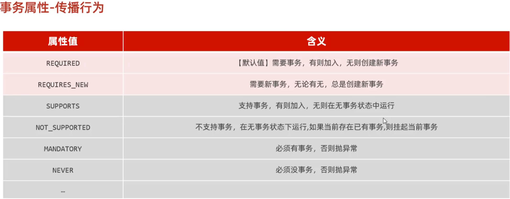

（原创）事务管理&AOP面向切面编程
***
## 一、事务管理
#### 事务的定义
> 一组操作的集合，它是不可分割的单位，要么都成功，要么都失败。
#### 事务的四大特性
> 1. 原子性：事务的各个操作时不可分割的，要么都成功，要么都失败。
> 2. 一致性：事务的执行的前后数据的完整性保持一致。
> 3. 隔离性：多个事务并发执行时，一个事务的执行不应影响其他事务的执行。
> 4. 持久性：一个事务一旦提交，它对数据库中数据的改变应该是永久性的。
#### 事务的操作
> 1. 开启事务：begin;//一组操作开始前，开启事务。
> 2. 提交事务：commit;//一组操作执行成功后，提交事务，使操作永久生效。
> 3. 回滚事务：rollback;//操作中任何一个操作出现异常，回滚事务，使所有操作都失效。
#### Spring事务管理 

- 声明式事务管理：基于AOP配置管理的，使用@Transactional注解，或者基于xml配置文件管理。
`@Transactional`:用于业务层中的方法、类、接口上。将当前方法交给spring管理，spring会自动开启事务，提交事务，回滚事务。它提供了两个常见属性：rollbackFor和propagation。
> @Transactional在默认情况下，只有出现RuntimeException才回滚异常。rollbackFor用于控制出现何种异常类型，回滚事务。
```java
@Transactional(rollbackFor = Exception.class)
```
> noRollbackFor用于控制出现何种异常类型，不回滚事务。
```java
@Transactional(noRollbackFor = Exception.class)
```
propagation属性：Spring控制事务传播行为(指的是当一个事务方法被另一个事务方法调用的时候，这个事务方法应该如何进行事务控制)的属性。
```java
@Transactional(propagation = Propagation.REQUIRED)
```
> REQUIRED:默认值，表示当前方法必须运行在事务中，如果当前事务存在，方法会加入到当前事务中，如果当前事务不存在，则开启一个新的事务。
> REQUIRES_NEW:表示当前方法必须运行在事务中，如果当前事务存在，则把当前事务挂起，创建一个新的事务，如果当前事务不存在，则开启一个新的事务。
> 


## 二、AOP面向切面编程
### 1. 什么是AOP
> AOP（Aspect Oriented Programming）面向切面编程，它是一种编程范式，它将横切关注点（跨越应用程序多个模块的功能）模块化，以实现横切关注点与业务逻辑的分离。可以理解为面向特定方法编程。
### 2. AOP的作用
> 1. 代码复用：将一些常用的功能抽取出来，封装成一个切面，在需要的地方进行引用。
> 2. 代码模块化：将横切关注点模块化，使代码更加清晰，易于维护。
### 3. AOP的实现
> javase提供的动态代理技术是面向切面编程的最主流实现。SpringAOP是Spring框架的高级技术，旨在管理bean对象的过程中，通过底层的动态代理机制，对特定的方法进行编程。
### 4.AOP在Spring中的实现
> 导入依赖：pom.xml文件中导入spring-aop的依赖。
```xml
<dependency>
    <groupId>org.springframework.boot</groupId>
    <artifactId>spring-boot-starter-aop</artifactId>
</dependency>
```
> 编写切面类：在切面类上添加@Aspect注解，表示该类是一个切面类。
```java
@Aspect //表明是一个aop类，不是普通类
@Component
public class MyAspect {
    //前置通知 第一个*是指返回值为任意类型。第二个*表示任何类名，不限制具体的类。第三个*是指匹配任何方法名。(..) 表示匹配任何参数列表，即这些方法可以有任意数量和类型的参数。
    @Before("execution(* com.example.demo.service.*.*(..))")//切入点表达式
    public void before(){
        System.out.println("前置通知");
    }
    //后置通知
    @After("execution(* com.example.demo.service.UserService.*(..))")
    public void after(){
        System.out.println("后置通知");
    }
    //环绕通知
    @Around("execution(* com.example.demo.service.UserService.*(..))")
    public Object around(ProceedingJoinPoint joinPoint) throws Throwable {
        System.out.println("环绕通知开始");
        Object result = joinPoint.proceed();
        System.out.println("环绕通知结束");
        return result;
    }
}
```
> execution表达式：execution(访问修饰符 返回值类型 包名.类名.方法名(参数列表))。
> @Before：前置通知，在目标方法执行之前执行。
> @After：后置通知，在目标方法执行之后执行。
> @Around：环绕通知，在目标方法执行之前和之后都执行。
> @AfterReturning：返回通知，在目标方法执行之后，且返回值之后执行。
> @AfterThrowing：异常通知，在目标方法执行之后，且抛出异常之后执行。

- aop编程的优点：
1. 代码无侵入：将一些常用的功能抽取出来，封装成一个切面，在需要的地方进行引用。
2. 减少重复代码
3. 提高开发效率
4. 维护方便：将横切关注点与业务逻辑分离，使代码更加清晰，易于维护。

### 5. AOP核心进阶
#### 5.1 AOP术语
> 1. 连接点（JoinPoint）：程序执行过程中的一个点，如方法调用或异常处理。
> 2. 切入点（Pointcut）：一组连接点的集合，用于定义切面在哪些连接点执行。
> 3. 通知（Advice）：在连接点执行的操作，如前置通知、后置通知、环绕通知等。
> 4. 切面（Aspect）：由切入点与通知组成，用于定义横切关注点。
> 5. 目标对象（Target Object）：被代理的对象。
#### 5.2 AOP执行流程
> 一旦我们进行了aop程序开发，最终运行的就不是原始的目标对象，而是代理对象。代理对象在执行目标方法时，会先执行通知，然后再执行目标方法。
#### 5.2 AOP进阶
##### 5.2.1 通知类型
> 1. 前置通知（Before）：在目标方法执行之前执行。
> 2. 后置通知（After）：在目标方法执行之后执行。
> 3. 环绕通知（Around）：在目标方法执行之前和之后都执行。
> 4. 返回通知（AfterReturning）：在目标方法执行之后，且返回值之后执行（有异常不执行）。
> 5. 异常通知（AfterThrowing）：在目标方法执行之后，且抛出异常之后执行。

@pointCut：将公共的切入点表达式抽取出来，使用@pointCut注解进行标记，在通知中引用该切入点表达式。
```java
@Pointcut("execution(* com.example.demo.service.*.*(..))")
private void pointCut(){} //设置为public则其他切面类可以引用该切入点表达式
@Before("pointCut()")
public void before(){
    System.out.println("前置通知");
}
```
##### 5.2.2 通知顺序
当有多个切面的切入点匹配到目标方法，目标方法运行时，多个通知方法都会被执行。它们的执行顺序为：
> 目标方法前的通知方法：按照@Order注解的值从小到大执行，如果没有@Order注解，则按照它们在切面类中字母排名的顺序由前到后执行。

目标方法：目标方法执行。
> 目标方法后的通知方法：按照@Order注解的值从大到小执行，如果没有@Order注解，则按照它们在切面类中字母排名的顺序由后到前执行。
##### 5.2.3 切入点表达式
定义：描述切入点方法的表达式。
作用：主要用来决定项目中的哪些方法需要加入通知。
实现：
> 1.execution(目标方法访问修饰符? 返回值类型 包名.类名.?方法名(参数列表) throws 异常类型?)   根据方法的签名来匹配(问号前指定的内容可省略)。

> 通配符：`*`:单个独立的任意符号，可以通配任意的返回值、包名、类名、方法名、任意类型的一个参数，也可以通配包、类、方法名的一部分。`..`:多个连续的任意符号，可以通配任意层级的包，任意类型、任意个数的参数（包括无参）。
> 多个切入点表达式的连接：使用`||`连接。

> 2.@annotation(......)：用于匹配标识有特定注的方法。对多个切入点表达式进行连接时简化代码。实现过程为自定义注解再引用注解。
```java
@Target(ElementType.METHOD)
@Retention(RetentionPolicy.RUNTIME)
public @interface MyAnnotation {
}
```
```java
@Aspect
@Component
public class MyAspect {
    @Before("@annotation(com.example.demo.aop.MyAnnotation)")
    public void before(){
        System.out.println("前置通知");
    }
}
```


##### 5.2.4 连接点
在spring中用JoinPoint抽象了连接点，用它可以获取方法执行时的相关信息，如目标类名、方法名、参数列表等。
对不同的通知类型获取的方式也不同：
1.对@Around通知：获取连接点信息只能使用ProceedingJoinPoint，它继承了JoinPoint，并新增了proceed()方法。
2.对@Before、@After、@AfterReturning、@AfterThrowing通知：获取连接点信息只能使用JoinPoint。
```java
@Around("execution(* com.example.demo.service.*.*(..))")
public Object around(ProceedingJoinPoint joinPoint) throws Throwable {
    System.out.println("环绕通知开始");
    Object result = joinPoint.proceed();
    System.out.println("环绕通知结束");
    return result;
}
```
