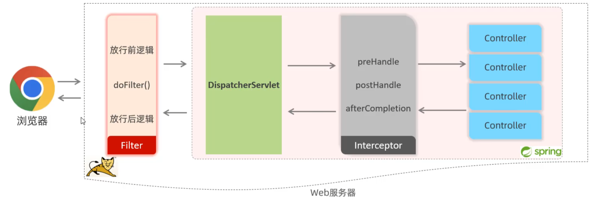

（原创）登录校验与认证
***
## 1. 登录认证
### 1.1 会话技术
##### 定义
> 浏览器与服务器之间的一次连接。会话从用户打开浏览器访问服务器开始，到关闭浏览器结束。一次会话中可以包含多次请求响应。

### 1.2 会话跟踪
##### 定义
> 服务器要识别多次请求是否来自同一浏览器，以便在同一次会话的多次请求间共享数据。
### 1.3 会话技术分类
##### 1. 客户端会话跟踪技术：cookie
- 优点：HTTP协议中支持的技术，自动执行。
- 缺点：1.移动端app无法使用。2.不安全，用户可以自己禁用cookie。3.不能跨域（跨域的三个维度：协议、 IP/域名、端口）。
##### 2. 服务端会话跟踪技术：session
- 优点：1.存储在服务端，安全。
- 缺点：1.服务器集群环境下无法直接使用Session。2.cookie的缺点。
##### 3. 客户端会话跟踪技术: 令牌技术
- 优点：1.PC端、移动端app都可以使用。2.不依赖cookie，可以跨域。3.解决集群环境下的认证问题。3.减轻服务器端存储压力。
- 缺点：1.需要自己实现认证逻辑。
### 1.2 令牌技术详解
#### 1.2.1 JWT
##### 定义
> JSON Web Token，是一种跨域认证解决方案。
##### 1.2.2 JWT组成
- Header：头部，包含令牌类型和所使用的加密算法。
- Payload：载荷，包含需要传递的数据。
- Signature：签名，对Header和Payload进行加密。
##### 1.2.3 JWT使用
- 生成：服务器生成JWT，返回给客户端。
- 校验：客户端每次请求时，携带JWT。
- 解析：服务器解析JWT，获取数据。
### 1.3 过滤器Filter（tomcat提供）
#### 1.3.1 执行流程
- 1.请求->放行前逻辑->放行->资源->放行后逻辑。
#### 1.3.2 拦截路径
- 在Filter类中配置拦截路径：
```java
@WebFilter("/*")
```
>  举例： /*可以替换为/login，表示只拦截login请求。

#### 1.3.3 过滤器链
##### 定义
> 一个web应用中，配置了多个过滤器，多个过滤器组成一个过滤器链。

##### 注意
> 过滤器链中，执行优先级是按照过滤器类名（字符串）的字母顺序排序。

### 1.4 拦截器Interceptor（spring提供）
#### 1.4.1
##### 定义
> 拦截器是SpringMVC提供的一种动态拦截方法调用的机制。作用是拦截请求，在指定的方法调用前后，根据业务需要执行预先设定的代码。

#### 1.4.2 拦截路径
- 在拦截器类中配置拦截路径：
```java
@Override
//addPathPatterns表示需要拦截的路径
//excludePathPatterns表示不需要拦截的路径

public boolean addInterceptor(InterceptorRegistry registry) {
    registry.addInterceptor(new LoginInterceptor()).addPathPatterns("/**").excludePathPatterns("/login");
    return true;
}
```
`/*`: 一级路径
`/**`: 所有路径
`/dept/*`: dept下所有路径，不包括子路径
`/dept/**`: dept下所有路径，包括子路径

#### 1.4.3 interceptor执行流程


### 1.5 拦截器interceptor与过滤器Filter的区别
- 1.接口规范不同：过滤器需要实现Filter接口。拦截器需要实现HandlerInterceptor接口。
- 2.拦截范围不同：过滤器能拦截所有资源。拦截器只能拦截spring环境中的资源。

### 1.6 异常处理
#### 1.6.1 全局异常处理
##### 定义
> 在SpringMVC中，通过使用@ControllerAdvice注解，可以定义一个全局异常处理类，用于处理整个应用程序中的异常。

##### 使用
- 1.定义全局异常处理类，并使用@ControllerAdvice注解。
- 2.在全局异常处理类中，定义异常处理方法，并使用@ExceptionHandler注解。
- 3.在异常处理方法中，处理异常，并返回相应的结果。

##### 示例
```java
@ControllerAdvice
public class GlobalExceptionHandler {

    @ExceptionHandler(Exception.class)
    public String handleException(Exception e) {
        // 处理异常，并返回相应的结果
        return "error";
    }
}
```


### 问：httpservletrequest和servletrequest有什么区别？
答：`HttpServletRequest` 和 `ServletRequest` 都是 Java Servlet API 中的接口，但它们之间存在一些关键的区别：

1. **继承关系**:
   - `ServletRequest` 是一个抽象类，它是所有特定于协议的 Servlet 请求对象的超类。它定义了所有 Servlet 请求共有的基本属性和方法。
   - `HttpServletRequest` 是 `ServletRequest` 的子接口，专门为处理 HTTP 请求而设计。它继承了 `ServletRequest` 的所有方法，并添加了一些特定于 HTTP 协议的方法。

2. **功能范围**:
   - `ServletRequest` 提供了获取请求参数、属性、输入流等基本功能，但它不包含任何特定于 HTTP 的方法。
   - `HttpServletRequest` 除了包含 `ServletRequest` 的所有功能外，还提供了许多特定于 HTTP 的方法，如获取请求头、请求方法（GET、POST 等）、请求路径、查询字符串、客户端地址等。

3. **使用场景**:
   - 如果你的 Servlet 需要处理多种类型的请求（例如，HTTP、HTTPS 或其他自定义协议），你可以使用 `ServletRequest` 作为参数类型，以保持代码的通用性。
   - 如果你的 Servlet 专门处理 HTTP 请求，使用 `HttpServletRequest` 作为参数类型可以提供更丰富的功能和更好的类型安全性。

4. **类型转换**:
   - 在某些情况下，你可能需要从 `ServletRequest` 转换到 `HttpServletRequest`。这通常发生在一个通用的 Servlet 框架中，你需要处理特定的 HTTP 请求特性。这可以通过类型检查和转换来实现，例如：
     ```java
     if (request instanceof HttpServletRequest) {
         HttpServletRequest httpRequest = (HttpServletRequest) request;
         // 使用 HttpServletRequest 的特定方法
     }
     ```

总结来说，`HttpServletRequest` 是 `ServletRequest` 的一个扩展，专门为 HTTP 请求提供额外的功能。在实际开发中，你应该根据 Servlet 的具体需求选择使用哪一个接口。如果你的 Servlet 只处理 HTTP 请求，使用 `HttpServletRequest` 会更方便和直观。如果你需要编写更通用的代码，可以处理多种类型的请求，那么使用 `ServletRequest` 可能更合适。