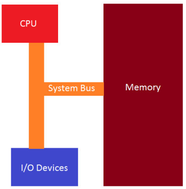

（原创）计算机组成原理部分基础知识补充说明
***
## x86 程序集简介
### 定义
- 一系列向后兼容的汇编语言，它们提供与 Intel 8000 系列微处理器的兼容性。x86 汇编语言用于为上述系列处理器生成目标代码。它使用助记词来表示 CPU 可以执行的指令。
> 注意： 我们还将专注于 32 位架构，因为最终大多数恶意软件都将为此编写，以便感染尽可能多的系统。32 位应用程序/恶意软件将在 64 位系统上运行，因此我们想了解 32 位世界的基础知识。

> x86 汇编语言有两种语法选择。自从操作系统是在AT&T Bell Labs开发的以来，AT&T语法在Unix世界中占据主导地位。相比之下，Intel 语法最初用于 x86 平台的文档，并在 MS-DOS 和 Windows 环境中占主导地位。

> 就我们的目的而言，当我们最终拆卸或调试软件时，无论是在 Linux 还是 Windows 环境中，我们都会在很大程度上看到 Intel 语法。无论我们检查的是 PE 格式的 Windows 二进制文件还是 ELF 格式的 Linux 二进制文件，这都是必不可少的。两者之间的主要区别在于AT&T语法，源在目标之前，而在Intel语法中，目标在源之前。
### x86 基本体系结构
- 基本架构由 CPU、内存和 I/O 设备组成，它们是输入/输出设备，它们都通过系统总线连接，如下所述。

- CPU 由 4 个部分组成，它们是：

    1.控制单元 - 从 CPU 检索和解码指令，然后在内存中存储和检索它们。

    2.执行单元 - 执行获取和检索指令的地方。

    3.寄存器 - 内部 CPU 内存位置使用临时数据存储。

    4.Flags - 指示执行发生的事件。

### 指令执行流程
- 执行完一条指令后，CPU 进入内存并按顺序获取下一条机器指令。CPU 有一个寄存器，我们将在以后的教程中讨论这个寄存器，称为 EIP 或指令指针，它包含要从内存中获取然后执行的下一条指令的地址。
- 我们可以立即看到，如果我们控制了 EIP 的流，我们就可以改变程序来做它不打算做的事情。这是恶意软件运行的一种流行技术。

### 寄存器
#### 定义
- 位置 ：位于CPU内部。
- 容量 ：数量有限，通常几十到几百个寄存器。每个寄存器的大小相对较小（如32位或64位）。
- 访问速度 ：非常快，因为它们直接与CPU的核心组件（如算术逻辑单元、控制单元等）相连，几乎不需要时间进行数据传输。
- 用途 ：用于存储当前正在处理的数据和指令操作数。寄存器是CPU的高速缓存，专门设计用于临时存储数据以加快计算速度。
#### 分类
##### 通用寄存器
- 通用寄存器用于在处理器上处理数据时临时存储数据。可用于保存任何类型的数据，其中一些寄存器已获得程序中使用的特定用途。
  - 案例：IA-32 架构中的 8 个通用寄存器
    - EAX：用于算术计算的主寄存器。也称为累加器，因为它保存算术运算的结果和函数返回值。
    - EBX：基寄存器。指向 DS 段中数据的指针。用于存储程序的基址。
    - ECX：Counter 寄存器通常用于保存一个值，该值表示流程要重复的次数。用于循环和字符串操作。
    - EDX：通用寄存器。此外用于 I/O 操作。此外，还将 EAX 扩展到 64 位。
    - ESI：Source Index 寄存器。指向 DS 寄存器指向的 segment 中数据的指针。用作字符串和数组操作中的偏移地址。它保存从中读取数据的地址。
    - EDI：目标索引寄存器。指向 ES 寄存器指向的 segment 中的数据（或目标）的指针。用作字符串和数组操作中的偏移地址。它保存所有字符串操作的隐含写入地址。
    - EBP：基指针。指向堆栈上数据的指针（在 SS 段中）。它指向当前堆栈帧的底部。它用于引用局部变量。
    - ESP：堆栈指针（在 SS 段中）。它指向当前堆栈帧的顶部。它用于引用局部变量。
    - 请记住，上述每个 registers 的长度均为 32 位或 4 字节。EAX、EBX、ECX 和 EDX 寄存器的低 2 个字节都可以由 AX 引用，然后按名称 AH、BH、CH 和 DH 细分（高字节）和 AL、BL、CL 和 DL（低字节，每个字节 1 字节）
##### 段寄存器
- 段寄存器专门用于引用内存位置。有三种不同的访问系统内存的方法，我们将重点介绍与我们的目的相关的平面内存模型。
    - 分类：6种
      - CS：代码段寄存器，存储用于数据访问的代码段（.text 段）的基本位置。
      - DS：数据段寄存器，存储用于数据访问的变量（.data 部分）的默认位置。    
      - ES：在字符串操作期间使用的额外段寄存器。
      - SS：堆栈段寄存器，存储堆栈段的基址位置，在隐式使用堆栈指针或显式使用基指针时使用。
      - FS：额外的段寄存器。
      - GS：额外的段寄存器。
      - 段寄存器被视为操作系统的一部分，在几乎所有情况下都不能直接读取或更改。在保护模式平面模型（32 位的 x86 体系结构）中工作时，程序运行并接收一个 4GB 地址空间，任何 32 位寄存器都可能寻址 40 亿个内存位置中的任何一个，但操作系统定义的受保护区域除外。物理内存可能大于 4GB，但 32 位寄存器只能表示 4,294,967,296 个不同的位置。如果您的计算机中有超过 4GB 的内存，则操作系统必须在内存中安排一个 4GB 区域，并且您的程序仅限于该新区域。此任务由 segment 寄存器完成，OS 对此保持密切控制。
##### 指令指针寄存器
- 称为 EIP 寄存器的指令指针寄存器是您在任何逆向工程中将处理的最重要的寄存器。EIP 会跟踪要执行的下一个指令代码。EIP 指向要执行的下一条指令。如果要更改该指针以跳转到代码中的另一个区域，则可以完全控制该程序。

##### 控制寄存器
- 用于确定 CPU 的运行模式和当前执行任务的特性。
  - 分类： 5种
    - CR0：控制处理器运行模式和各种状态的系统标志。
    - CR1：（当前未实现）
    - CR2：内存页故障信息。
    - CR3：内存页目录信息。
    - CR4：启用处理器羽化并指示处理器功能部件的标志。
    - 每个控制寄存器中的值不能直接访问，但是控制寄存器中的数据可以移动到其中一个通用寄存器，一旦数据位于 GP 寄存器中，程序就可以检查寄存器中的位标志，以确定处理器的运行状态与当前正在运行的任务。如果需要更改控制寄存器标志值，则可以更改 GP 寄存器中的数据，并将寄存器移动到 CR。低级系统编程器通常会修改控制寄存器中的值。普通应用程序通常不会修改控制寄存器项，但是它们可能会查询标志值以确定当前运行程序的主机处理器芯片的功能。

### Flags 标志
#### 定义
- 是一种简单的机制，通过设置或清除特定的位来表示不同的状态或选项。每个位（bit）可以是0或1，分别表示未启用（false）和启用（true）。例如，在一个8位标志中，可以有8种不同的状态组合。
#### 分类
- 状态标志：
  - CF：携带旗帜
  - PF：奇偶校验标志
  - AF：调整旗帜
  - ZF：零旗
  - SF：标志标志
  - OF：溢出标志
- 控制标志：用于控制处理器中的特定行为。
  - DF 标志是 direction 标志，用于控制处理器处理字符串的方式。设置后，字符串指令会自动递减内存地址以获取字符串中的下一个字节。清除后，字符串指令会自动递增内存地址以获取字符串中的下一个字节。
- 系统标志：用于控制操作系统级别的操作，这些操作绝不能被任何相应的程序或应用程序修改。
  - TF：陷阱标志
  - IF：中断使能标志
  - IOPL：I/O 权限级别标志
  - NT：嵌套任务标志
  - RF：恢复标志
  - VM：Virtual-8086 模式标志
  - AC：对齐检查标志
  - VIF：虚拟中断标志
  - VIP：虚拟中断挂起标志
  - ID：识别标志
### Stack 栈
#### 定义
- 当程序开始执行时，为称为堆栈的程序留出某个连续的内存部分。
- 堆栈指针是包含堆栈顶部的 register 。堆栈指针包含最小的地址，例如0x00001000，因此任何小于 0x00001000 的地址都被视为垃圾地址，任何大于 0x00001000 的地址都被视为有效地址。栈向上增长，但实际上它是从较高内存向下增长到较低内存。堆栈底部是堆栈的最大有效地址。
- 堆栈限制是堆栈的最小有效地址。如果堆栈指针小于此值，则会出现堆栈溢出，这可能会损坏程序，从而允许攻击者控制系统。恶意软件试图利用堆栈溢出。截至最近，现代操作系统中内置了一些保护措施，试图防止这种情况发生。
#### 作用
- 栈来实现函数。对于每个函数调用，都有一个为函数保留的堆栈部分。这称为堆栈帧。
### Heap 堆
#### 定义 
- 堆是计算机内存中未自动管理的区域，也不由 CPU 严格管理。它是内存的自由浮动区域，大于内存的栈分配。要在堆上分配内存，必须使用 malloc（） 或 calloc（），它们是内置的 C 函数。在堆上分配内存后，您有责任在不再需要内存时使用 free（） 取消分配该内存来释放它。如果不执行此步骤，程序将存在所谓的内存泄漏。也就是说，堆上的内存仍将被留出，并且不可供其他需要它的进程使用。与栈不同，堆对可变大小没有大小限制。唯一会限制堆的是计算机的物理限制。堆内存的读取和写入速度稍慢，因为您必须使用指针来访问堆上的内存。与栈不同，在堆上创建的变量可由程序中的任何位置的任何函数访问。堆变量本质上是全局范围的。注意：栈向下增长，堆向上增长。
#### 作用
- 如果你需要为结构体或大型数组之类的东西分配一个大的内存块，并且你需要在程序的很长一段时间内保持该变量，并且必须全局访问，那么你应该为此选择堆。如果您需要可以动态更改大小的变量（如数组和结构体），例如可以根据需要增长或收缩的数组，则可能需要在堆上分配它们，并使用动态内存分配函数（如 malloc（）、calloc（）、realloc（） 和 free（） ）来手动管理该内存。

### 堆栈总结
- 在计算机科学中，"堆"和"栈"这两个术语确实可能会引起混淆，因为它们在不同的上下文中具有不同的含义。下面是详细对比说明：
  - 1.在计算机架构中，堆是一种内存区域，负责动态分配和管理程序所需的内存。而在数据结构领域，堆是指特定类型的二叉树，用于高效地存储和检索元素。
  - 2.在计算机架构中，栈是一种内存区域，负责临时存储和管理程序执行过程中的数据。而在数据结构领域，栈是抽象的数据类型和操作集合，适用于各种需要后进先出访问的应用场景。
  - 3.计算机架构中的栈和数据结构中的栈都遵循后进先出的原则，但在具体实现和用途上有所不同。前者是内存区域的一部分，主要用于存储程序执行的临时数据；后者是一个抽象的数据类型，适用于多种需要LIFO访问的应用场景。计算机架构中的堆 和数据结构中的堆 在名称上有一定的关联性，但实际含义不同。前者用于动态分配内存；后者是一种特殊的二叉树，支持优先级管理。