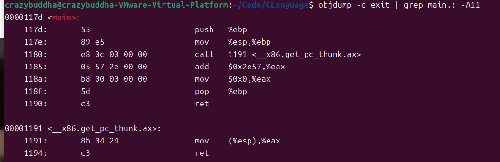

（原创）Linux与汇编语言简单的聊几句
***
## 为什么要学习汇编语言？
- 大多数恶意软件都是用高级语言编写的，但是大多数恶意软件作者不会向攻击者提供源代码，以便他们能够正确处理他们精心设计的攻击。黑客使用多种高级语言，对新的专业恶意软件分析师逆向工程师的需求每天都在增长。当我们检查恶意软件时，我们不仅仅得到一个编译的二进制文件。对于编译好的二进制文件，我们唯一能做的就是用汇编语言逐条指令地分解它，因为所有东西最终都会归结为汇编语言。了解汇编语言允许在正在运行的进程上打开调试器。每个正在运行的程序都有一个 PID，PID 是一个数值，用于指定正在运行的程序。如果我们使用像 GDB 这样的专业或开源工具打开一个正在运行的进程或任何一点恶意软件，我们可以准确地看到发生了什么，然后抓住 EIP 指令指针去我们需要它去的地方，以完全控制程序流。

## 指令代码处理
- CPU 读取存储在内存中的指令代码，因为每个代码集可以包含一个或多个字节的信息，这些信息指导处理器执行非常具体的任务。当每个指令代码都是从内存中读入时，指令代码所需的任何数据也会被存储并读入内存。指令指针用于帮助 CPU 跟踪哪些指令代码已经被处理以及接下来要处理哪些代码。如果您不理解此概念，请查看第 12 部分 – 指令指针寄存器。每个指令代码都必须包含一个操作码，该操作码定义 CPU 要执行的基本函数或任务，操作码的长度在 1 到 3 字节之间，并唯一定义要执行的函数。

## 编译程序具体实现案例
### Step1
```c
// 在linux系统上mkdir Code一个test.c文件,输入这段代码并按esc后输入:wq保存
int main(void){
    return 0;
}
```
### Step2
- 这个步骤将创建 exit.o（二进制文件）和 exit（二进制可执行文件）。
> 在目标文件所在目录打开控制台并输入：gcc -m32 -ggdb -o exit test.c

- 如果我们想将此 C 源代码转换为 Assembly，我们需要按以下方式使用 GNU 编译器。让我们首先在终端中运行以下命令.
> gcc -S -m32 -O0 test.c
- 让我们从 -S 开关开始。-S 开关将创建类似的 AT&T 语法汇编源代码。-m32 将创建一个 32 位可执行文件，而 -O0 将告诉编译器在编译二进制文件时要使用多少优化。那就是大写的 O 和数字 0。在这种情况下，数字 0 表示没有优化，这意味着它是最人类可读的指令集。如果要替换 1、2 或 3，则优化量会随着值的增加而增加。
- 上面的步骤创建了test.s，这是我们上面提到的等效的汇编语言源代码。内容如下：
```Unix Assembly
	.file	"test.c"
	.text
	.globl	main
	.type	main, @function
main:
.LFB0:
	.cfi_startproc
	pushl	%ebp
	.cfi_def_cfa_offset 8
	.cfi_offset 5, -8
	movl	%esp, %ebp
	.cfi_def_cfa_register 5
	call	__x86.get_pc_thunk.ax
	addl	$_GLOBAL_OFFSET_TABLE_, %eax
	movl	$0, %eax
	popl	%ebp
	.cfi_restore 5
	.cfi_def_cfa 4, 4
	ret
	.cfi_endproc
.LFE0:
	.size	main, .-main
	.section	.text.__x86.get_pc_thunk.ax,"axG",@progbits,__x86.get_pc_thunk.ax,comdat
	.globl	__x86.get_pc_thunk.ax
	.hidden	__x86.get_pc_thunk.ax
	.type	__x86.get_pc_thunk.ax, @function
__x86.get_pc_thunk.ax:
.LFB1:
	.cfi_startproc
	movl	(%esp), %eax
	ret
	.cfi_endproc
.LFE1:
	.ident	"GCC: (Ubuntu 13.2.0-23ubuntu4) 13.2.0"
	.section	.note.GNU-stack,"",@progbits
```
### Step3
- 我们需要将 Assembly 源代码编译成一个二进制对象文件，这将生成一个 exit.o 文件。
> gcc -m32 -c test.s -o test.o
### Step4
- 最后，我们需要使用链接器从二进制对象文件创建实际的二进制可执行代码，这将创建一个名为test的可执行文件。
> gcc -m32 test.o -o test
- 在一个名为objdump的程序中检查可执行文件出口。
> 控制台输入：objdump -d exit | grep main.: -A11




## 汇编语言程序引言
### 组成部分
#### 数据部分：
- 此部分用于声明初始化的数据或常量，因为这些数据在运行时永远不会更改。您可以声明常量值、缓冲区大小、文件名等。
#### BSS部分：
- 该部分用于声明未初始化的数据或变量。
#### 文本部分：
- 此部分用于实际代码部分，因为它以全局_start开头，告诉内核执行从何处开始。

### 特点
- 汇编语言语句在每行一个语句中输入，因为您不必像许多其他语言那样以分号结束该行。语句的结构如下：
> [label] mnemonic [operands] [comment]
一条基本指令有两部分，第一部分是指令的名称或执行的助记词，第二部分是命令的操作数或参数。
