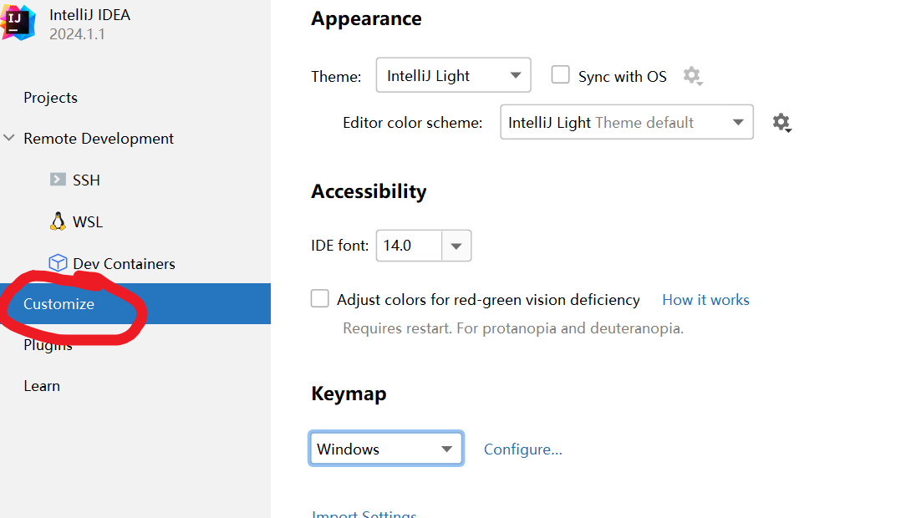
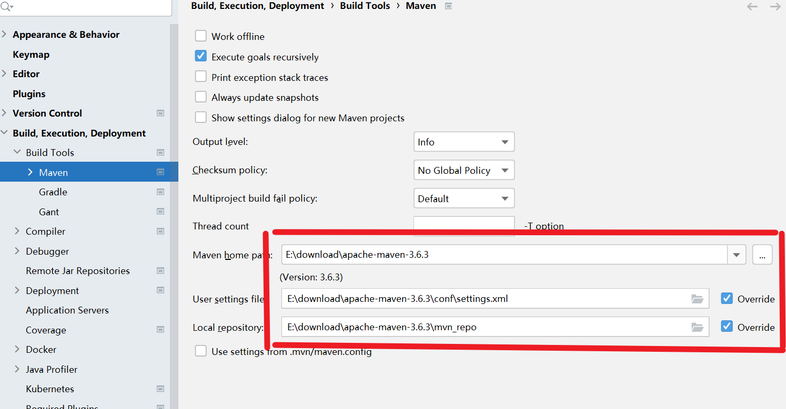
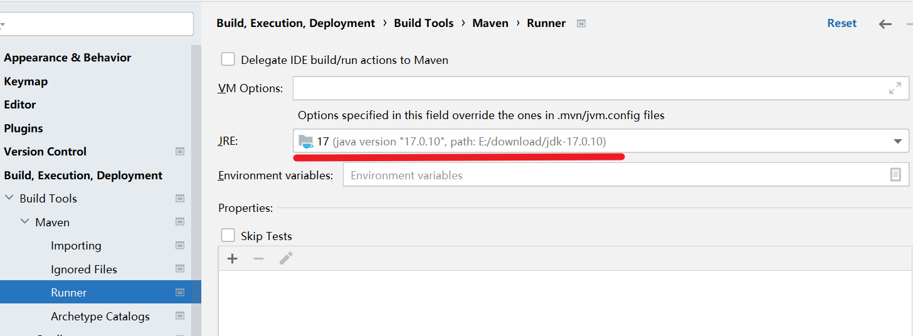
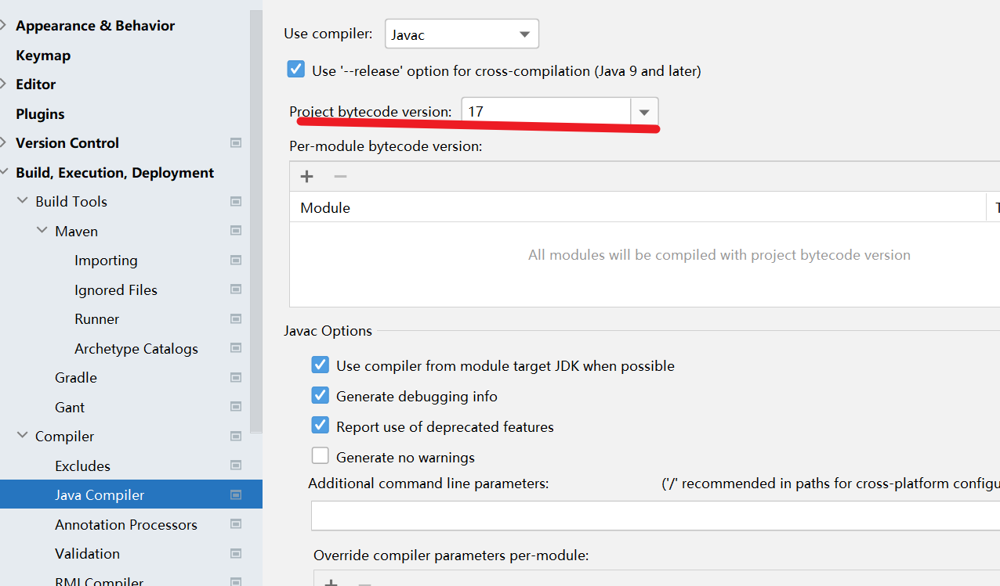
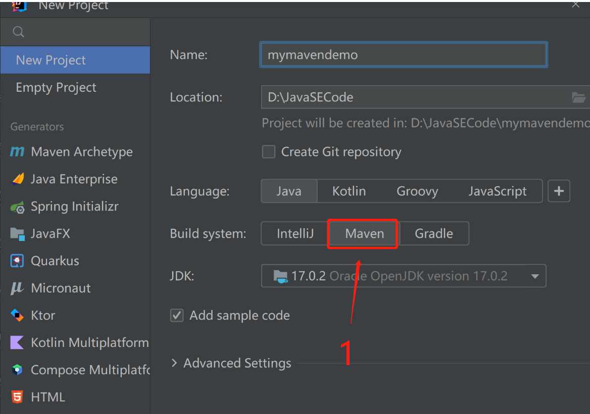
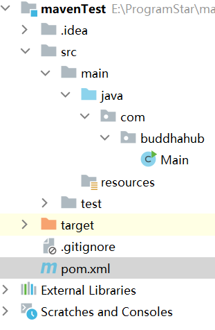
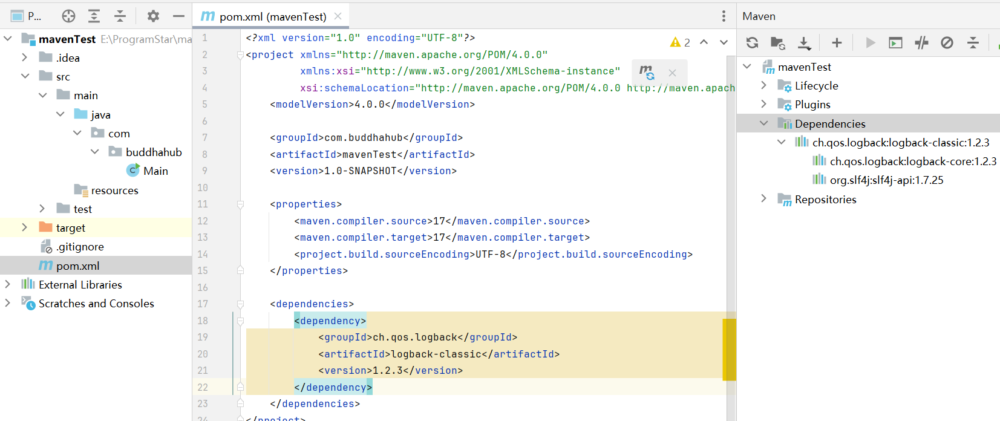
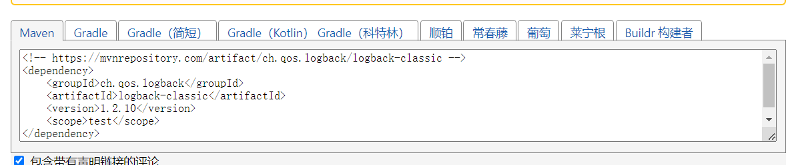
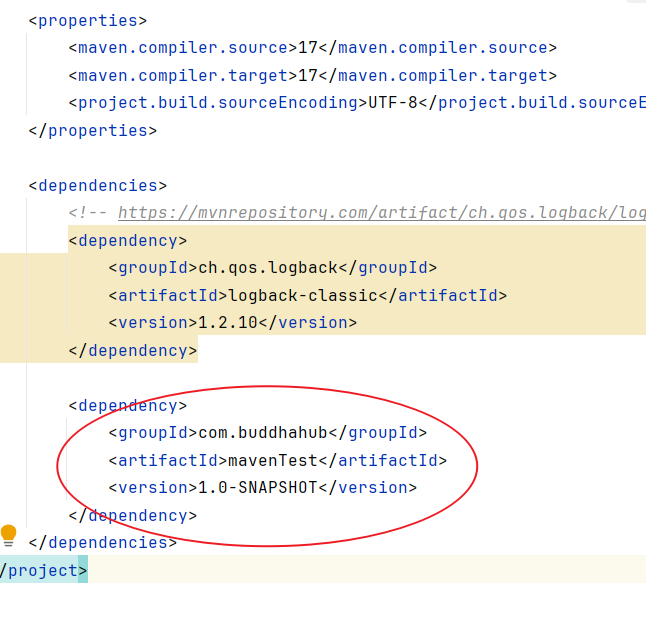

原创：IDEA中的Maven使用方法
***
### 一、IDEA中配置Maven配置（全局环境）
1. 打开idea，选择全局设置。  


1. 修改成maven本地存放路径，建议本地依赖存放到maven本地文件夹里的新建文件夹mvn_repo中。  


3. 打开runner目录，建议选择java开发版本17([springboot3支持的java最低版本](https://docs.spring.io/spring-boot/docs/3.0.13/reference/html/getting-started.html#getting-started))。  

  
4. 项目字节码版本要与第三步中JRE版本一致。  

  
***
- ### <span style='color:red'>注意：</span>
 
> 这样创建常规maven，Maven Archetype是要使用模板的，注意区别。

  

 # 二、Maven坐标  
 ***
__定义__

- <u>maven资源的唯一标识，通过该坐标可以唯一定位资源位置。</u>

**<span style='color:purple'>组成</span>**

<span style='color:pink'>groupId</span>
- <u>maven项目隶属组织名称</u>

<span style='color:orange'>artifactId</span>
- <u>maven项目名称</u>

<span style='color:green'>version</span>  
- <u>maven项目版本号</u>

***
- ### <span style='color:red'>注意：</span> 
在maven项目文件中的pom.xml文件中可以设置或者查看maven坐标。



# 三、导入maven工程
***
- 方法一： 打开IDEA，选择右侧maven面板，点击 + 号，双击目标项目的pom.xml文件即可。

- 方法二： 打开IDEA，选择file，选择project structure，点击 + 号，选择Import Module，双击目标项目的pom.xml文件即可。 

***
- ### <span style='color:red'>注意：</span> 
> 想要彻底删除某个maven项目的话，直接在IDEA中delete是不能彻底删除的，还要在磁盘目录中删除项目文件  

# 四、maven依赖配置与管理
***
###导入依赖

- 1. 打开maven项目的pom.xml文件。

- 2. 在project标签中填写dependencies标签，然后在dependencies标签下添加dependency标签，dependency标签有三个子标签groupId，artifactId和version，artifactId中填写需要添加的依赖资源,点击IDEA自动补全的groupId和version标签。

- 3. 点击maven中的load maven change，下载依赖到本地。


***
- ### <span style='color:red'>注意：</span>
> 如果导入依赖的第二步中无法自动补全，则表示本地依赖中没有使用过该依赖。可以通过[maven依赖仓库](https://mvnrepository.com/)把依赖信息复制粘贴进三个子标签中。网站中可以选择想要依赖的版本号，复制依赖的坐标信息即可。(需要删除复制代码中的scope标签)
  
***

### 依赖传递

- 依赖具有传递性,可以通过引入依赖的方式对不同maven项目的依赖进行引用。
- 如果一个依赖本身也有自己的依赖，那么这些依赖就是传递依赖。Maven 会自动解析这些依赖，并将它们添加到项目的类路径中。


> 可以发现，如果对不同依赖进行引用，可能会导致引入不必要的依赖，如何解决呢？
***

### 排除依赖

- 可以使用如下格式的坐标信息来删除指定的依赖。

```xml
<dependencies>
    <!-- 其他依赖 -->
    <dependency>
        <groupId>需要排除依赖的groupId</groupId>
        <artifactId>需要排除依赖的artifactId</artifactId>
        <version>依赖的版本</version>
        <exclusions>
            <exclusion>
                <!-- 排除特定的依赖 -->
                <groupId>要排除的groupId</groupId>
                <artifactId>要排除的artifactId</artifactId>
            </exclusion>
        </exclusions>
    </dependency>
    <!-- 其他依赖 -->
</dependencies>
```
***
### 依赖范围
- 依赖的jar包默认在任何地方使用。可以通过scope标签设置作用范围。

| scope | 主程序 | 测试程序 | 打包（运行） | 范例 |
| ----- | -------| ------- | ----------- | ---- |
| compile（默认） | Y | Y | Y | log4j |
| test | - | Y | - | junit |
| provided | Y | Y | - | servlet-api |
| runtime | - | Y | Y | jdbc驱动 |

> 如果scope是默认值，可以不添加scope标签。
***
# 五、maven生命周期

- 作用  
    - maven生命周期是对所的maven项目构建过程进行抽象和统一。

- 组成部分 (<span style='color:purple'>maven中有三套相互独立的生命周期</span>)
    - --> clean: 清理工作。
    - --> default: 核心工作：编译，打包，安装，部署等。
    - --> site: 生成报告、发布站点等。
> 有五个生命周期阶段是常用且必须掌握的。
> 1. clean生命周期中的clean阶段。作用：移除上一次构建生成的文件。
> 2. default生命周期中的compile阶段。作用： 编译项目源代码。
> 3. default生命周期中的test阶段。 作用： 使用合适的单元测试框架运行测试（junit）。
> 4. default生命周期中的package阶段。 作用： 将编译后的项目打包，如jar, war。
> 5. default生命周期中的install阶段。 作用： 安装项目到本地仓库。
***
- ### <span style='color:red'>注意：</span>
> 每套生命周期内包含一些阶段，阶段是有顺序的，后面的阶段依赖于前面的阶段。同一套生命周期中，后面的阶段执行则前面的阶段会一起执行。
***
### 执行指定生命周期的两种方式

- 方法一：IDEA中点击右侧maven，选择对应的生命周期，双击执行。

- 方法二：命令行输入mvn {想要执行的生命周期名称，例如：clean}。
***